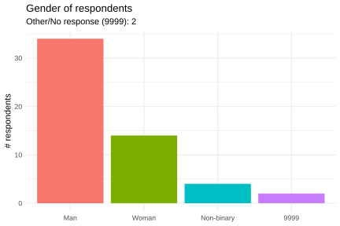
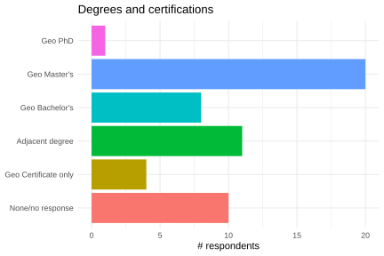
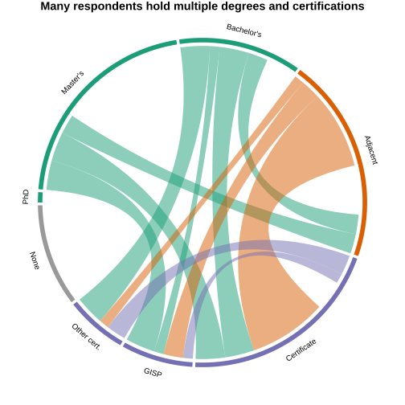

# DEMOGRAPHICS

`01-demographics.R`

Total number of respondents

# 54

## Gender

| Gender      | n    | Percent |
| ----------- | ---- | ------- |
| No response | 2    | 3.70%   |
| Man         | 34   | 62.96%  |
| Non-binary  | 4    | 7.41%   |
| Woman       | 14   | 25.93%  |

## Experience

| Index | Description          | Years       | n    |
| ----- | -------------------- | ----------- | ---- |
| 0     | No response          | —           | 3    |
| 1     | Somewhat experienced | A few years | 6    |
| 2     | Experienced          | 5–10 years  | 12   |
| 3     | Very experienced     | 10–20 years | 23   |
| 4     | Expert               | 20+ years   | 10   |

## Degrees and Certifications

No response: 10 people

---

**Survey options**

1. Bachelor’s degree in cartography/GIS/geography
2. Master's degree in cartography/GIS/geography
3. Ph.D. degree in cartography/GIS/geography
4. GISP certification
5. GIS or cartography certificate
6. Other professional certification in cartography/GIS
7. Degree in a map-adjacent field (e.g., geology, environmental science, visual arts, graphic design)
8. Other: ___

**Notes:**

1. if someone has both a geo and adjacent degree, they're in the geo bucket
2. if someone has both an adjacent degree and certificate(s) but no geo degree,

   they're in the adjacent bucket

- one person said "computer science", i added that as a geo-adjacent degree

- one person said "some college", they were added to "none"

---

### Respondents who hold any degree

Includes adjacent degrees not related to GIS/geography/cartography

# 39 / 72.2%

### GIS/geography/cartography degrees (#1-3)

Collapsed to highest level obtained

# 29 / 53.7%

| GIS/geo/carto degree | n    | Percent |
| -------------------- | ---- | ------- |
| Bachelor's           | 8    | 14.81%  |
| Master's             | 20   | 37.04%  |
| PhD                  | 1    | 1.85%   |
| None / not specified | 25   | 46.30%  |

### Other combinations

| Credentials                                             | N    | Percent | Description                                           |
| ------------------------------------------------------- | ---- | ------- | ----------------------------------------------------- |
| Degree(s) ONLY, no certification(s)                     | 22   | 40.7%   | Any degree                                            |
| Degree(s) PLUS certification(s)                         | 17   | 31.5%   | Any degree                                            |
| Map-adjacent degree PLUS geo degree                     | 14   | 25.9%   | #7                                                    |
| Map-adjacent degree, NO geo degree                      | 11   | 20.4%   | Excludes those who have a GIS/geo/carto degree (#1-3) |
| Map-adjacent degree PLUS geo degree OR certification(s) | 10   | 18.5%   | Includes #4, 5, 6                                     |
| Certification(s) ONLY, no degrees                       | 4    | 7.4%    | Includes #4, 5, 6                                     |

## Multiple credentials

I've only accounted for the highest degree attained, so if someone has a Master's I didn't count the Bachelor's.  But, maybe I should have, because those are all accomplishments in their own right!  I think the way I counted makes sense for the chart, though.  

| number of credentials | N    | Percent |
| --------------------- | ---- | ------- |
| 0                     | 10   | 18.5%   |
| 1                     | 25   | 46.3%   |
| 2                     | 16   | 29.6%   |
| 3                     | 1    | 1.9%    |
| 4                     | 2    | 3.7%    |

---

This chord diagram only shows co-occurrences because it was built on a pairwise matrix. There are **2** people with **4** credentials and **1** who holds **3**, and those are reflected here as pairs but not as a traceable 3 or 4 way connection.  It's a small number of respondents so I don't think it detracts too much from the overall message.  

There is no delineation of degree levels (Bachelor's, Master's, Ph.D.) in the **adjacent** category, those could be anything, I suppose.  

