# RATES

`02-rates.R`

No response: 6 people

---

### During the last 12 months, how much money did you **typically** receive per hour of time spent on freelance mapmaking work?

*Please enter an amount in US Dollars. Estimates are fine; get as close as you can. Whether you charge by the hour or by the project (or both), please estimate how much money a client usually paid for an hour of your time spent mapping.*

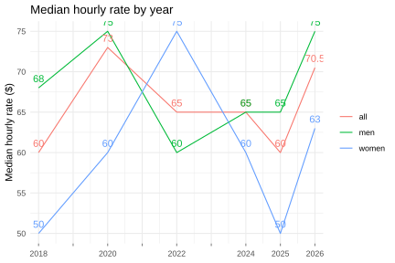

### Median hourly rate per year by gender

| Year |  All |  Men | Women |
| ---: | ---: | ---: | ----: |
| 2018 |   60 |   68 |    50 |
| 2020 |   73 |   75 |    60 |
| 2022 |   65 |   60 |    75 |
| 2024 |   65 |   65 |    60 |
| 2025 |   60 |   65 |    50 |
| 2026 |   71 |   75 |    63 |

### Change in hourly rate compared to previous year, per respondent

---

During the year prior to that (i.e., the time span between 12 and 24 months ago), how much money did you **typically** receive per hour of time spent on freelance mapmaking work?

*If you were not freelancing at that time, leave this blank.* *Please enter an amount in US Dollars. Estimates are fine; get as close as you can. Whether you charge by the hour or by the project (or both), please estimate how much money a client usually paid for an hour of your time spent mapping.*

**Outlined dot**: no rate entered for previous year
**Solid dot**: no change from previous year

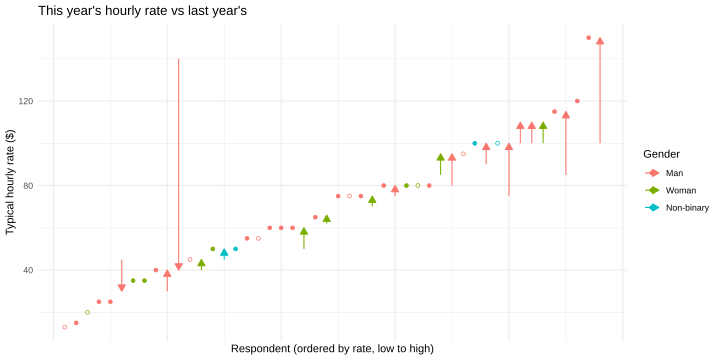

### Rate by educational attainment

---

Probably not enough data points here for these numbers to be significant. 

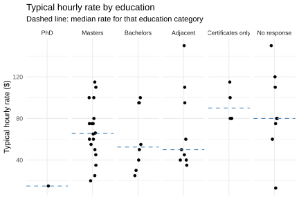

### Which of these options best describes you level of mapmaking experience?

---

*Estimate of the number of years you've spent doing mapmaking work (freelance or otherwise), taking into account whether that work was full time. If you were working part-time, studying, or working a job where you had significant non-mapmaking responsibilities, these would only count toward a portion of a full year of experience.*

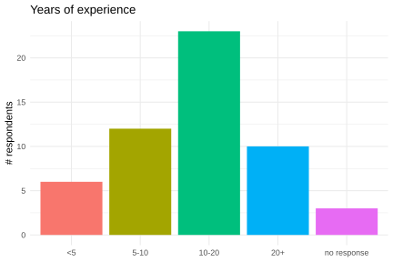

### Is there a relationship between experience and typical hourly rate?

---

##### Not statistically significant.

Spearman's rho: p-value = `0.55` :thumbsdown:

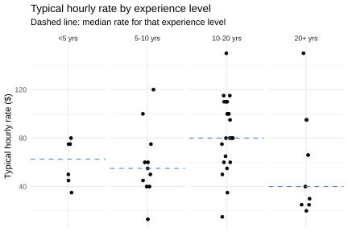

### How often do you feel you are paid fairly for your time when doing freelance mapping? 

---

| Index | Answer                  | N    |
| ----- | ----------------------- | ---- |
| 4     | Never                   | 1    |
| 3     | Rarely                  | 9    |
| 2     | Some of the time        | 20   |
| 1     | Most or all of the time | 22   |
| 9999  | No response             | 2    |

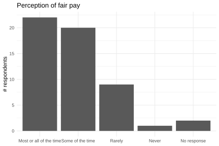

### Is there a relationship between rates and perception of getting paid fairly?

---

##### Yes, there's a statistically significant correlation. 

Those who feel they're not being paid fairly more often tend to report lower rates. 

Spearman's rho: p-value = `0.001`​ :thumbsup:

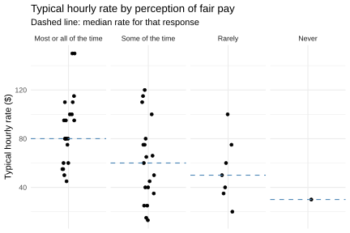

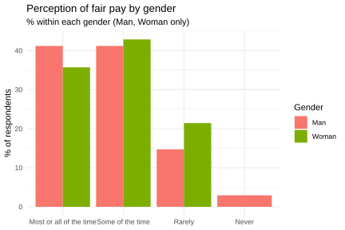

### Have the published results of previous versions of this survey influenced your business practices or rates?

---

| Answer                                     | N    |
| ------------------------------------------ | ---- |
| Yes                                        | 23   |
| No                                         | 13   |
| I haven't seen any previous survey results | 17   |
| No response                                | 1    |

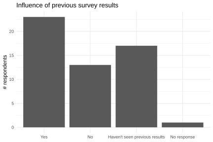

### If you answered "Yes" above, please optionally indicate how previous surveys influenced you.

---

*We like to hear about how this exercise has been useful to our community! Your comments are anonymous. We might quote you when publishing the results of this survey.*

| Open ended answers                                           |
| ------------------------------------------------------------ |
| Before these surveys came out, I had no idea how others were navigating freelancing and was basically making it up as I went along. Now I'm just making a bit less up as I go along. ;) |
| Helped me set rates by knowing averages in the field         |
| I have continued to feel confident in my rate by seeing what others are charging. |
| I increased my rates after reading the 2023 survey           |
| It gave me the confidence to start charging a higher rate    |
| It has helped me set my hourly rate.                         |
| It's always good to see how much others charge. I am hopeful we are all keeping up with inflation this year! |
| It’s given me confidence to charge higher (consultancy) rates and see how other peers charge. |
| It’s helpful to know the ‘going rate’ for freelance GIS work. |
| Makes me more confident when negotiating rates               |
| raised my rates                                              |
| They helped me set my base rates                             |
| This has helped me understand whether the rates I ask are within reason |
| While markets vary, knowing what other people charge per hour is very helpful. |
| While typically operating in a vacuum, it's great to see where my rates fall amongst peers. For my part, freelance rates run on a sliding scale where similarly minded, value-aligned non-profits having a worthy cause typically receive a reduced hourly rate and extractive industy clients are charged double (and in some cases triple). Thank you for putting this together and sharing! |

## Dependence on freelance

In the last year, how much did you depend on your freelance cartography income? 

| Index | Answer                                                       | Respondents |
| ----- | ------------------------------------------------------------ | ----------- |
| 1     | I depended on it completely; freelance mapping was necessary for my survival | 17          |
| 2     | I depended on it substantially; it would have been possible, but challenging, to survive without my freelance income | 4           |
| 3     | I depended on it somewhat; it would not have been difficult to survive without freelance income, but it helped make it easier | 11          |
| 4     | I did not depend on it at all; mapping provided surplus income | 20          |
| 9999  | No response                                                  | 2           |

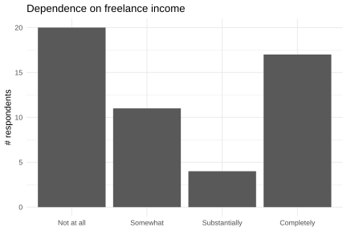

### Is there a relationship between hourly rate and dependence on freelance income? 

---

##### Maybe. Weak but statistically significant correlation.

Freelancers who depend more on freelance income tend to report higher rates.

Spearman's rho: p-value = `0.04` :ok_hand:

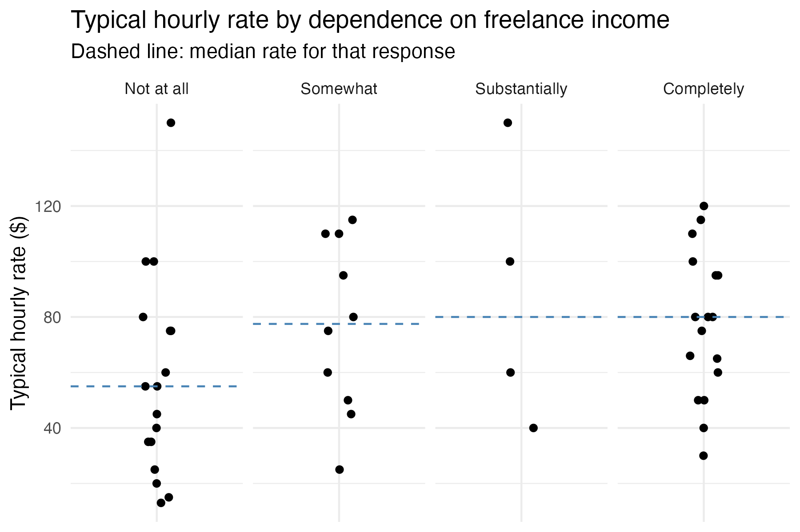

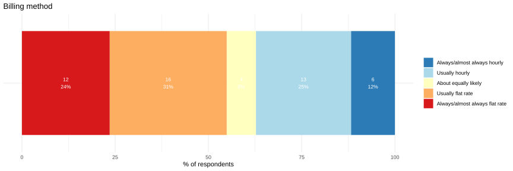

### Are any of these patterns statistically significant?

---

##### No. 

There's no real pattern here, mostly noise. Data is too sparse, maybe.

Spearman's rho: p-value = `0.3996` :thumbsdown:

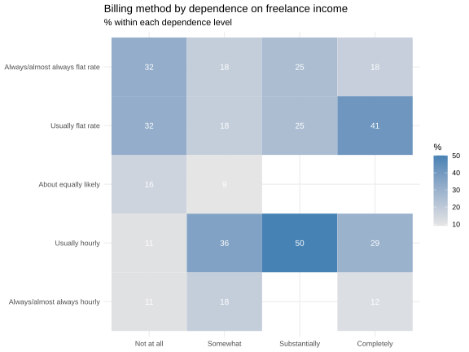