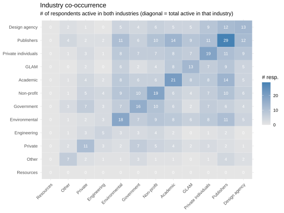
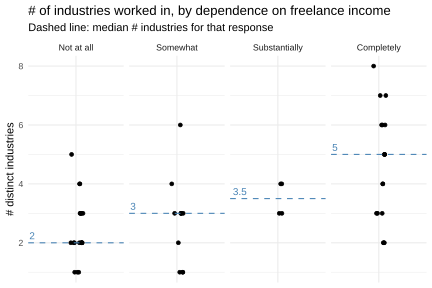
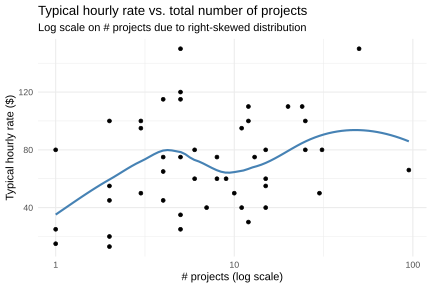
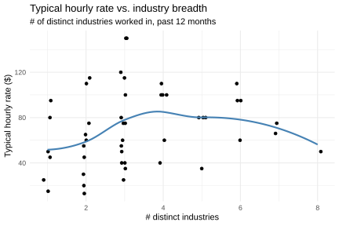
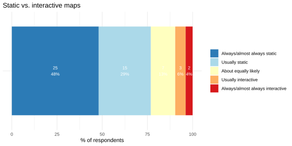
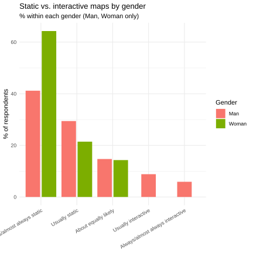

# PROJECTS

`03-projects.R`

No response: 4 people

---

### How many freelance cartography projects did you work on in the last year?

*Feel free to give a close estimate if you don't want to count them up.*

#### median

# 6.5

#### mean

# 11.66

Right-skewed distribution, most people had 1-15 projects, a handful had 20-95(!)

There's one respondent who had a psychotic number of projects last year: **95**. Mostly in **academia** and for publishers/authors/media organizations. 

The second highest was **50**: almost entirely in the "other" category. They entered **energy, geology, outdoors**.  This is interesting because I think it should fall under the **resources** category, which has **zero** projects listed by anyone. 

I tried two histograms. 

1. *Binwidth = 0*

2. *Binwidth = 5*
   Honestly, I don't know if this grouping below works, I think the chart above is better but is a bit harder on the eyes. The chart below would need some more work on the x-axis tick labels, but it does provide a better idea of the curve at a glance. 

### In the last year, approximately how many projects did you work on for clients that belonged to each of these industries?

---

Need to be careful reading this one since the multiple choice answers were ranges, not actual numbers.  

Each bar segment represents the *percentage* of respondents who had `0`, `1`, `2-3`, `4-5`, or `6+` projects in that industry. 

Note: as stated above, maybe **resources** should have at least one entry from the one person who had 50 projects in "energy, geology, and outdoors." Here, it's **0**.

### Industry participation per respondent

---

This heat map shows all the survey respondents (one column per person) (minus 4 who left this blank). 

Note: if we use both this one and the above chart, match the colour scales (they're different rn).  Same note as above for **resources** category.

### Are there industries that tend to be worked on by the same freelancers? 

---

Note: delete bottom right segment of triangle plus middle diagonal.

Not sure if we should include this one, it's only mildly interesting?

### If you answered "Other industries," what sorts of industries should we consider including in the list next time? 

---

:thinking: I wonder if some people may have answered this in two ways: 

1. I worked in industries not listed here
2. I have ideas for other industries to include next time

| Open ended answers                                           |
| ------------------------------------------------------------ |
| destination marketing organizations, real estate company     |
| Education/curriculum development                             |
| energy, geoglogy, outdoors,                                  |
| Golf courses                                                 |
| Law Firm                                                     |
| Retirement Community - campus map. Maybe the category woud be Real Estate? Housing Community? - Other work I did for a graphic design firm was for their brochure for a developer showing lots sold. I call these "Community Maps" in my own bookkeeping records. |
| Transportation & Corporate C-Level map integration           |

### Do those who depend more on freelance for income tend to work across more or fewer industries? 

---

##### Yes, strong correlation. Those who depend more on freelance income tend to participate in more industries. 

Spearman's rho correlation: p-value = `0.0001` :thumbsup:

### Is there a relationship between the number of projects and the level of dependence on freelance income? 

---

##### Yes, strong correlation. Those who depend more on freelance income tend to do more projects. 

Spearman's rho test: p-value = `< 0.001` :thumbsup:

### Is there a relationship between the number of projects and typical hourly rate? 

---

##### Meh, not really. Weak correlation.

Spearman's rho p-value = `0.05`  :confused:

### Do generalists (more distinct industries) earn a different rate than specialists (fewer industries)?

---

##### Nah, weak correlation. 

Spearman's rho: p-value `0.05` :thumbsdown:

### Which is more typical for you: to make static maps for your clients, or interactive/animated ones? 

---

*Static maps are those that are not animated, and have no interactive features.*

### Is there a gender differences when it comes to who produces static vs interactive maps? 

---

##### No. Not statistically significant. Let's leave this one out.

Wilcoxon rank-sum test: p-value = `0.1161` :thumbsdown:
Fisher's exact test: p-value = `0.6805` :thumbsdown:

